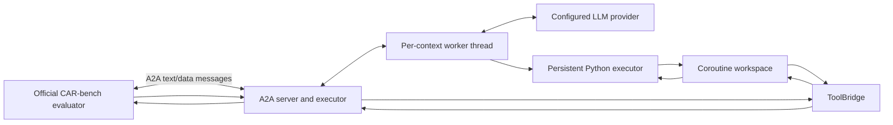

# Coroutine Agent Architecture and Reliability Techniques

Status: active implementation reference
Last verified against code: 2026-06-26
Agent package: `src/track_1_agent_coroutine_under_test/`

Recent deltas (2026-06-21) — the **facts-vs-intention** refactor: the runtime
now enforces facts and strict policy but leaves interpretation to the model.
(1) The active-nav guard no longer redirects — it returns a structured
`NEEDS_ACTIVE_ROUTE_EDIT` block (with `candidate_destination_id` and
`active_route`) and the model chooses the edit. (2) Failed mutations are tracked
by `(tool, target args)` so one target's success can't clear another's failure,
with a conservative proved-by-read reconciler (a window-position read clears a
window-close failure). (3) Success-path helpers no longer lock the response
(`_helper_message` records a suggested sentence) so the model composes one
message covering every subgoal and warning; locking is reserved for terminal
conditions (missing capability, confirmation ask, policy block, info
unavailable, unrecoverable failure). (4) Route narration is staged
(`search`=offer, `select`="selected for this segment",
`navigate`="this route segment is now using") so a read is never narrated as an
action; multi-segment waypoint edits can store one grounded narration per new
segment so the response covers both sides of the edit. (5) Contacts/POIs are normalized
additively (`get_contact_id_by_contact_name` to `contact_ids`/`by_id`; POIs gain
`poi_id`/`plug_ids`) preserving the raw result. (6) Batched helper results hoist
non-reserved keys onto the envelope, now tagged with the name the model called
(not the internal `*_guarded` target). (7) An absent-waypoint delete reports
`already_absent`/`waypoint_deleted: False` instead of claiming a deletion.
The follow-up reliability pass keeps this boundary while removing observed
regressions: helper suggestions accumulate instead of overwriting one another;
mandatory policy disclosures are response obligations appended only when the
model omitted them; mutation failures survive all Python blocks in one user
turn; exact window-field mappings replace substring proofs; identical
same-state reads are cached and marked `no_progress` without blocking further
reasoning; successful mutations invalidate that cache. Navigation mutations
persist returned waypoint/route state with a revision and invalidate stale route
options. Nested contact names and charging-plug lists are normalized additively.
Mixed batches preserve the model's original result order. A second ergonomics
pass adds `ws.facts`/`ws.entities`/`ws.gates`, stable route aliases
(`selected_route_id`, fastest/shortest IDs), normalized contact `matches`,
POI `navigation_id` vs `host_location_id`, numeric `remaining_range_km`, a
terminal unavailable-range sentinel when `remaining_range` is missing or
`None` or cannot be parsed, numeric route `distance_km` plus a numeric
`distance` alias, and safe serialization of arbitrary model-owned scratchpad
values.
Selected
grounded entities such as `last_routes`, `last_route_options`, `last_pois`,
`last_charging_specs_and_status`, `selected_route`, selected POIs, selected
charging plugs, and recent location lookups are also mirrored at scratchpad top
level and refreshed as Python globals before each code block. These names are
only aliases for facts already stored under
`scratchpad["entities"]`; if the entity disappears, the alias is removed before
the next execution. Known pure context callables are resolved before helper
execution and persistence. Final destination replacement keeps a valid
model-supplied route ID or fills the route only when exactly one option exists;
it does not parse user language or preferences. Before the first model
decision, navigation state is refreshed per user turn and user preferences are
read once per task when the official preference tool is exposed. Both are
stored as facts. After serializing the scratchpad, the agent appends
**preflight attention messages**: short static policy reminders placed next to
the fields they apply to. The reminders do not derive an answer from those
values, parse user wording, or block a tool. The model remains responsible for
interpreting the request and choosing the action. This mechanism can be
extended to other frequently relevant grounded state, including disambiguation
facts, while preserving the same facts-vs-intention boundary.
`set_new_navigation(...)` on an active route remains a fact-only
`NEEDS_ACTIVE_ROUTE_EDIT` result and does not redirect to a mutation.
Confirmation-required wrappers store the fully grounded action before asking,
so a follow-up `handle_pending_confirmation()` resumes the exact call.
Consecutive contact lookups expose their grounded ID intersection without
selecting a recipient, and `get_next_calendar_entry()` performs the
current-policy-day calendar read and returns the next entry without interpreting
the user's larger workflow. Two additional runtime-boundary checks are now
fact-based and non-task-specific: confirmation-required `send_email(...)`
repairs a single-recipient address only when a unique contact intersection is
known and the chosen address belongs to a different grounded contact; and
`set_new_navigation(...)` validates known multi-leg route chains, replacing a
stale/base route ID only when there is a unique known connecting route. If route
facts are incomplete, the model's call is left alone; if all facts are known and
the chain is impossible with no unique repair, the wrapper returns
`ROUTE_CHAIN_MISMATCH` rather than emitting a guaranteed-invalid evaluator call.
Recent helper reliability additions keep the same boundary. Unknown
`remaining_range` from `get_charging_specs_and_status(...)` is stored as a
terminal fact for range/charging math in that user request, blocking downstream
charging calculations instead of allowing `unknown km` answers. The user-facing
limitation also says charging-stop planning cannot be completed from available
car data, which keeps long-route planning and email flows from sounding like a
narrow range-only answer. Helpers that derive charging-search positions from
state use the same rule: numeric strings such as `155.0km` are parsed, but a
missing, `None`, or unparseable stored range does not fall back to a guessed
route midpoint. Long-route
email confirmation uses the same fact boundary: when a known route is long and
charging facts have not been read, `send_email(...)` returns a local
`NEEDS_MORE_FACTS` result so the model can read charging status before asking
for confirmation. This check uses structured route distance and stored charging
facts, not user-message keywords. Applied route records are preserved separately
from stale route-option lists as `active_route_records`, so clearing old choices
after a navigation mutation does not delete the distance facts needed by later
guards. Local control results such as `NEEDS_MORE_FACTS`,
`NEEDS_CLARIFICATION`, and `NEEDS_ACTIVE_ROUTE_EDIT` are not treated as failed
mutations because no evaluator side effect was attempted. For post-charge
route emails, `get_distance_by_soc(...)` results are normalized and persisted
as `last_distance_by_soc`; if the model has already calculated a charging plan
to a target SOC, confirmation-required `send_email(...)` can require that
official target-SOC range fact before the email is confirmed. This only applies
after a selected charging plan exists; the wrapper does not choose whether the
charging strategy should be current-location or along-route. Full-window opening
is also guarded at the
argument boundary: raw/default `percentage=100` window and sunroof calls ask for
a target percentage unless `open_close_window_safe(..., target_is_explicit=True)`
or `open_sunroof_safe(..., target_is_explicit=True)` marks the exact value as
already resolved. Defrost helpers apply a stored defrost
airflow preference only when it still includes `WINDSHIELD`; otherwise they
preserve an existing airflow mode that already includes `WINDSHIELD`, and only
set plain `WINDSHIELD` when the current mode lacks windshield airflow. The
charging boundary now checks grounded station/plug consistency: if a charging
calculation pairs a known station ID with a plug ID that is not one of that
station's known plugs, the call is repaired to that station's best known plug
before it reaches the evaluator. Route selection by explicit route ID also
falls back to the grounded `routes_by_id` registry when the supplied route list
has been overwritten by a later lookup. Navigation completion guarding covers
full navigation claims and route-leg setup claims, so text such as `I've set up
the first leg` is replaced by the grounded missing-control response unless a
navigation mutation actually succeeded. The
next-meeting charging planner now stores the selected charger, plug, provider
phone, and executable two-leg `navigation_route_ids`. The runtime no longer
repairs a direct destination route to those stored charging-stop route IDs by
reading the current user message; the model must call the explicit route-stop
helper or pass the two grounded route IDs itself.
Route-leg repair can also use explicit via-road wording from the current user
message, but only against already fetched route alternatives for the same
start/destination. This is a deliberate narrow exception to the "no missing
parameter inference from user text" helper rule: the helper is preserving an
explicit candidate label the user supplied in that turn, not inventing a missing
parameter or selecting a default. It does not carry previous raw wording through
a bare follow-up such as "continue"; cross-turn preservation should come from a
recorded `select_route(...)` fact. If no unique fetched route candidate matches,
the call is left alone. After a waypoint edit, route-based charging searches can
reuse the newly created route segment and grounded range facts only inside the
same user turn that created the route-edit context. Cross-turn charging-search
repair no longer scans the follow-up wording; the model should call
`search_charging_stations_on_route(...)` or pass an explicit route ID/kilometer.
For charging searches on a later active route segment, the wrapper can also
convert a recent official `get_distance_by_soc(...)` distance from global
current-location coordinates into segment-local `at_kilometer` coordinates by
subtracting earlier active segment distances. This repair only fires when the
model's requested kilometer already matches the grounded SOC-distance fact; it
does not parse the user message to discover a target SOC or invent a charger
search point.
The explicit helper
`find_charging_stop_on_active_route_by_soc(reserve_state_of_charge, ...)`
exposes the same boundary in a form the model can choose directly. The model
must supply the resolved reserve SOC number. The helper then reads active
navigation, charging status, official distance-by-SOC facts, converts the
current-location distance into the active segment coordinate system, calls
`search_poi_along_the_route(...)`, and stores selected charging/provider facts.
It never inspects raw user text or decides which SOC the user meant.
`search_charging_stations_on_active_route(at_kilometer, ...)` follows the same
rule for route-kilometer charger searches. The model must supply the resolved
kilometer, for example `100`; the helper reads active navigation, defaults to
the current first active segment unless a grounded route id is supplied, and
emits the real `search_poi_along_the_route(...)` call. If navigation is not
active and the model already has a grounded planned route id,
`search_charging_stations_on_route(route_id, at_kilometer, ...)` provides the
same route-search and charger/plug normalization without calling
`set_new_navigation(...)`. Both helpers can translate an explicit
`require_available=True` argument into the official availability filter when the
live task schema exposes that parameter, and neither helper infers route id,
kilometer, SOC, or availability intent from raw user text.
`estimate_charging_stops_for_route_by_soc_window(...)` similarly requires the
model to supply a grounded destination id, lower SOC, upper SOC, and any
resolved route preference. It calls route lookup plus official
`get_distance_by_soc(upper, lower)` and returns facts for the model to explain.
It does not derive SOC values or route preferences from task wording.
Route-edit narration uses the same grounded-facts boundary. For
`navigation_replace_one_waypoint(...)`, the guard records the selected route for
the segment into the replacement waypoint and the selected route for the
segment away from it, using only route IDs and aliases returned by
`get_routes_from_start_to_destination(...)`. After the mutation succeeds, the
response obligation appends both segment facts and a general alternatives
question when alternatives existed. It does not inspect user text to decide
which segment matters.
Weather lookup normalization follows the same shape-only principle:
`get_weather_guarded(...)` clamps month/day to the policy date, preserves an
explicit hour/minute chosen by the model or helper, hoists active-slot fields
such as `condition` and `temperature_c` to stable top-level aliases, and stores
`scratchpad["entities"]["last_weather"]`. It does not infer a weather branch
from user-message keywords.
Arrival-weather navigation helpers use response obligations for the same
fact-only purpose: after `navigate_to_poi_by_arrival_weather(...)` or
`navigate_to_poi_unless_arrival_weather(...)` chooses the fallback branch from
grounded arrival-weather facts, the final answer must include the blocked
weather condition and fallback destination. The obligation does not choose the
branch; it only prevents the model from omitting the branch reason after the
helper has already made the evaluator-visible navigation call.
Successful climate-temperature setters also have a narrow response repair:
if the model says "degrees" without Celsius after a successful
`set_climate_temperature(...)`, `respond(...)` rewrites the assistant's own
wording to "degrees Celsius". This enforces the unit policy on completed
temperature actions without reading user wording or changing tool arguments.
Contact lookup normalization also stays grounded in existing tool state. After a
calendar read, `get_contact_id_by_contact_name_guarded(...)` intersects same-name
contact candidates with recent calendar attendee IDs. A unique attendee match is
ranked first while `unconstrained_contact_ids` preserves the raw candidate
order. If the model explicitly passes
`constrain_to_recent_calendar_attendees=True`, the wrapper narrows the normalized
result to that attendee subset before the model asks for contact details. The
raw evaluator still receives only the official contact-name arguments.

Prior deltas (2026-06-20): removed the catalog-diff missing-capability
inference for compliance (now reactive live-membership, see Competition
Compliance); added output-key rendering (`original_tool_outputs.json`) incl.
dynamic-key aliasing (`get_distance_by_soc` → `distance_km`,
`calculate_charging_time_by_soc` → `minutes`); expanded raw-path delegation to
ten tools (degenerate-call, active-route-edit, and `get_weather` day-clamp
guards); added the `set_occupied_seat_heating` helper; route-selection narration
(policy 022/021) now fires on plain route presentations and new-route sets, not
only edits; nav delete avoids the delete-loop when the target is already
removed (now reported as `already_absent`, see 2026-06-21). Evaluator is Gemini
2.5 Flash (the orgs' default/official judge).

This document describes the current participant-owned coroutine agent. It is
the source of truth for its architecture, prompt/runtime boundary, reliability
techniques, and maintenance rules.

The official evaluator is outside this architecture. It remains responsible
for task loading, simulated-user turns, CAR-bench tool execution, environment
state, trajectories, and scoring. The participant agent only consumes A2A
messages and emits A2A text or tool-call data.

## Design Goals

The agent is designed around four goals:

1. Let the model reason and branch using ordinary Python.
2. Make evaluator tools behave like blocking API calls inside that Python.
3. Move deterministic policy and missing-capability handling out of the model.
4. Keep every benchmark-visible action inside the official A2A trajectory.

The model has one action surface: `execute_python`. CAR-bench tools are exposed
inside the persistent Python workspace as functions such as
`get_weather(...)`, `send_email(...)`, and `set_fan_speed(...)`.

## Competition Compliance

The benchmark boundary is the A2A exchange with the evaluator. The harness may be
sophisticated, but only consumes benchmark-allowed inputs: the system prompt
(including policy), the transcript, the live tool definitions, and tool results.
The rules below were clarified directly with the organizers (2026-06; see
`hallucinations_tofix.md` and the participant Q&A) and are binding on this agent.

### Allowed (organizer-confirmed)

- **Internal helper/executor functions** that the model calls and that emit one
  or several of the task's *allowed* tools in sequence. The evaluator only ever
  receives normal `tool_calls` with the real tool/parameter names; it never sees
  helper names. Our policy helpers and `*_guarded` wrappers are exactly this.
- **Computing a parameter value with our own logic** from earlier tool results
  in the same task (e.g. deriving the reconnecting `route_id` for a waypoint
  delete from the current navigation state, default fastest per policy). Grounded
  IDs still come from real tool results — we never fabricate IDs.
- **Deciding not to emit a tool call** the agent judges invalid, and continuing
  (e.g. skipping a route lookup whose start and destination are the same).
- **Bundling the public tool catalog as static reference** (descriptions,
  parameter ranges, the set of wrapper names) while the per-task tool list stays
  the sole authority for what is callable.
- **Membership checks against the live per-task list**: "is the specific tool/
  parameter I need present in this task?" (`A in live_tools`). One list, one
  lookup.

Organizer Q&A evidence for this boundary:

```text
Participant follow-up, 2026-06-19:
I have an internal helper function AX (evaluator never sees AX by name) that my
agent uses. AX runs some logic, checks whether tool A is present in the per-task
tool list evaluator sent in first turn of task, calls the real tool A if it's
there (evaluator receives the normal A call), or skips it and reports it can't
if it isn't, then post-processes A's result. AX only ever checks evaluator's
per-task first-turn list and it never compares against any full/external tool
list. Allowed?

Johannes, 2026-06-19 18:07:
Yes, that's fine. And don't worry. Keep the questions coming if unsure!
```

### Not allowed

- **Inferring which tool/parameter was removed by comparing the full catalog to
  the per-task list** (the set difference `full − live`). This is the explicit
  hallucination-split exploit and is forbidden. The agent must not use the
  catalog as an oracle for "what is missing."
- Executing CAR-bench tools inside the participant container; inspecting
  evaluator files, hidden data, or answer keys; adding private vehicle-state /
  shell / network tools to the decision loop; hiding tool calls to dodge metrics.

### How this constrains missing-capability handling

The distinction is **membership vs. diff**. A helper knows the specific tools it
needs (their names are literals in its code) and asks "is this name in the live
list?" — allowed. Enumerating the catalog to compute the removed set — banned.
Accordingly, the runtime resolves missing tools/parameters **reactively** at call
time against the live surface (see Live Tool-Surface Membership). The earlier
proactive catalog-diff (`_infer_tool_surface_limitation_from_user_request`, the
original-vs-live parameter comparison, and `handle_missing_requested_capability`)
has been removed.

## High-Level Architecture



Each A2A `context_id` gets an independent long-lived
`CoroutineAgentWorker`. The worker owns:

- One persistent Python globals dictionary.
- One `CoroutineWorkspace`.
- One `ToolBridge`.
- One scratchpad.
- One compact model transcript.
- One token/latency accumulator.
- One JSONL trace file.

No state is shared between benchmark tasks except static code and bundled
public tool metadata.

## The Coroutine Bridge

The central mechanism is implemented by `ToolBridge`,
`BlockingPythonExecutor`, and `CoroutineCARBenchAgentExecutor`.

### Why It Exists

A normal A2A agent returns tool calls and receives results in a later HTTP
request. That normally prevents one Python execution from doing this:

```python
state = get_current_navigation_state(detailed_information=True)
if state["result"]["navigation_active"]:
    destination = state["result"]["details"]["waypoints"][-1]
    restaurants = search_poi_at_location(
        location_id=destination["id"],
        category_poi="restaurants",
    )
```

The coroutine bridge preserves this natural code pattern without executing
CAR-bench tools inside the participant container.

### Execution Sequence

1. The model emits one `execute_python` action.
2. The worker runs the code in its persistent Python thread.
3. A wrapper such as `get_current_navigation_state(...)` calls
   `ToolBridge.request_tool_calls(...)`.
4. The bridge places an `OutboundAction(tool_calls=...)` on the worker outbox
   and blocks the Python thread.
5. The A2A request handler returns those tool calls to the evaluator.
6. The evaluator executes the official tool and sends a new A2A environment
   message.
7. The request handler sees that the bridge is waiting and delivers the tool
   results directly to it.
8. The same Python call frame resumes with parsed results.
9. The code can branch, call another evaluator tool, or call `respond(...)`.

This is not replay. The same Python process, worker thread, local variables,
and stack frame remain alive while waiting for the next A2A inbound message.

### Parallel Calls

`batch([...])` sends independent evaluator calls in one A2A tool-call message:

```python
results = batch([
    ("get_weather", weather_args),
    ("get_exterior_lights_status", {}),
])
weather = result_value(result_by_tool(results, "get_weather"))
lights = result_value(result_by_tool(results, "get_exterior_lights_status"))
```

Sequential dependencies use normal function calls. Independent reads should
use `batch(...)` to reduce A2A latency.

Workspace helpers are Python functions, not evaluator tools. They can be
called directly or included by name inside `batch(...)`. In a mixed batch,
raw evaluator tools are still emitted together in one parallel A2A request,
while helpers execute through their Python implementations and may perform
their own staged tool calls. Dependent operations still must not be bundled
into the same `batch(...)`.

The returned result list preserves the input call order even though raw calls
are grouped for parallel transport and helpers execute separately.

Batch call names are normalized against the bundled public tool and helper
registry. Quoted names are preferred. Known preloaded wrapper/helper callables
are accepted through their canonical `__name__`; arbitrary callables and
objects are rejected as model-code errors instead of being misreported as
missing evaluator capabilities. Policy-sensitive setters retain the same safe
helper delegation whether called directly or through `batch(...)`.

## A2A Boundary

### Inbound Parsing

`CoroutineCARBenchAgentExecutor._parse_inbound()` extracts:

- The policy text and initial user request from the combined text part.
- The live task tool surface from `{"tools": [...]}`.
- Evaluator results from `{"tool_results": [...]}`.
- The source hint from `Message.metadata.source`.

Tool-result data takes precedence when deciding whether an inbound message is
from the environment. Empty user or environment messages are handled
explicitly.

### Outbound Rendering

The agent returns:

- A text part for a user-facing response.
- A data part containing `{"tool_calls": [...]}` for evaluator tool calls.

The participant runtime never executes CAR-bench vehicle, navigation, weather,
charging, communication, or productivity tools directly.

## Model and Prompt Architecture

### Model Action Contract

The model always produces:

```json
{
  "thought": "one or two short sentences",
  "code": "executable Python source"
}
```

Two transport modes are supported:

- `prompt_json`: the model emits the JSON object as text.
- `native`: the model calls a single native `execute_python` function tool.

`prompt_json` is the current default.

Malformed actions are repaired through a bounded schema retry loop. Provider
errors use a separate bounded retry loop with backoff for retryable failures.
Malformed Python that reaches the persistent REPL has its own guard: if the same
`SyntaxError`, `IndentationError`, or `TabError` repeats, the runtime stops the
turn instead of letting the model burn internal calls on near-identical broken
code. Non-Cerebras providers keep the guard simple and break after two identical
REPL errors without changing sampling settings. Cerebras gets one tested escape
hatch before that final stop: repeated identical REPL syntax failures retry with
the `CAR_AGENT_STORM_RETRY_TEMPERATURES` ladder, defaulting to `0.15,0.4,0.8`.
The per-call temperature override is scoped to Cerebras because that path was
tested and other APIs may process temperature differently.

### System Prompt Composition

`build_system_prompt()` combines:

1. The general runtime and execution rules.
2. The selected domain skill from `Skills/`.
3. The policy text received from the evaluator.
4. Descriptions of built-in workspace helpers.
5. Compact signatures and descriptions for the full public CAR-bench tool
   surface bundled with the agent.
6. The prompt-JSON output contract when enabled.

The full public catalog is shown as *reference* (organizer-confirmed allowed,
see Competition Compliance). The live task surface is authoritative at execution
time. The model calls the obvious public wrapper; when the call is executed, it
is resolved against the **live** per-task tool list, and if the tool or a
supplied parameter is not present in that task the runtime emits a grounded
limitation. The runtime never compares the catalog to the live list to infer
what was removed.

### Callable Surface

The model-facing prompt documents 104 callable entries:

- 57 public CAR-bench wrappers.
- 43 model-facing workspace/policy helpers.
- 4 pure extraction helpers (`id_value`, `pois_value`, `routes_value`, and
  `first_number_value`).

The tool/helper dispatch registry contains 109 known names: the 57 public
wrappers, 43 model-facing workspace helpers, and nine internal `*_guarded`
targets. Including the four pure extraction helpers, the REPL therefore has 113
relevant callable names, of which 104 are documented choices for the model.
The guard targets are internal implementations, not separately documented
choices. The model calls the corresponding public wrapper, and dispatch
transparently applies the guard.

This distinction avoids presenting both a public operation and its guarded
implementation as competing choices. True policy multitools remain visible
alongside their component tools where those component tools are also valid
independent operations.

### Compact Tool Rendering

`prompt_rendering.py` converts full JSON schemas into Python-like signatures:

```text
set_fan_speed(level=integer[0..10])
```

It preserves:

- Required versus optional arguments.
- Types and numeric ranges.
- Enum values.
- Array and nested object shapes.
- Argument descriptions containing operational constraints.
- Literal tool descriptions, including `REQUIRES_CONFIRMATION`.
- **Result key shapes** — each signature is suffixed with the tool's output
  keys, e.g. `get_temperature_inside_car() -> result{climate_temperature_driver,
  climate_temperature_passenger, temperature_unit}`.

The result-key shapes exist because OpenAI function-calling metadata only
declares inputs, not outputs. Without them the model writes the result access
path blind (it accesses a key in the same `execute_python` block as the call,
before the value arrives) and guesses — e.g. `temperature_driver` instead of
`climate_temperature_driver`, which silently yields `None`. Rendering the keys
removes this result-key-guessing failure class for all un-normalized read tools.

Static public schemas and metadata are stored in:

- `original_tool_schemas.json` — input parameter schemas.
- `original_tool_metadata.json` — names + descriptions.
- `original_tool_outputs.json` — stable result-key shapes per tool, compiled
  from observed evaluator tool results in our own run transcripts (benchmark-
  allowed transcript data; dynamic/parameterized-key tools with normalizer
  helpers are excluded). This is reference data, not a removal oracle.

  Compliance basis: output-key names are public by the benchmark's own choice —
  19 of the 42 tool *descriptions* already publish their result keys (e.g.
  `get_charging_specs_and_status`, `open_close_window`, `set_fan_speed`). We
  store only key **names** (never values), obtained from allowed tool-result
  transcripts, so this is the published-API contract — not hidden mock data,
  task definitions, or answer keys, and not task-specific.

These files are public API / observed-contract metadata bundled into the agent
image. They must not be generated from evaluator internals, hidden mock data, or
answer keys during a submission run.

## Context and Memory

The agent deliberately does not accumulate the full chat forever.

Within one internal model loop, the model sees its previous `execute_python`
action and the corresponding REPL observation. This supports recovery from code
errors and additional model reasoning when no outbound A2A action was produced.

Across A2A user turns, the model context is rebuilt from:

- The original system prompt.
- The initial user request.
- Stable environment messages, when applicable.
- Actual prior user follow-ups and outward assistant responses.
- The current scratchpad snapshot.
- Preflight attention messages adjacent to that snapshot.

Previous generated code and full REPL observations are dropped across user
turns. This preserves continuity without carrying large low-value transcripts.

### Scratchpad

The persistent scratchpad has three sections:

```python
scratchpad = {
    "gates": {},
    "entities": {},
    "facts": {},
}
```

- `gates` stores policy, confirmation, disambiguation, and capability verdicts.
- `entities` stores grounded IDs and selected objects.
- `facts` stores durable derived facts, helper reports, pending confirmations,
  and turn-local response/no-progress records.

Helpers write structured reports to `facts`, including
`last_helper_report`. This gives follow-up turns grounded continuity without
requiring the model to reconstruct prior tool results from prose.

Successful helper suggestions accumulate in `pending_helper_messages` for the
current user turn. Policy-mandated disclosures can additionally register a
`pending_response_obligation`; `respond(...)` appends only obligations the
model's text did not already satisfy. This preserves compound-request
flexibility without making required warnings optional.

### Preflight Attention Messages

A preflight attention message is a short prompt-level reminder placed directly
after freshly grounded scratchpad state. Its purpose is to make a
decision-relevant policy or disambiguation rule hard to overlook in a long
prompt. It is an attention mechanism, not a runtime decision mechanism.

The sequence is:

1. Read frequently needed system state through an official evaluator tool.
2. Normalize and store only grounded facts in the scratchpad.
3. Serialize the current scratchpad for the model.
4. Append a concise reminder that names the relevant fields and the general
   policy or disambiguation rule.
5. Let the model combine those facts with the user request and choose its next
   Python action.

The message text is static and general. Whether a message is included may depend
on the presence or category of grounded preflight state, and may point out
simple decision dimensions such as `is_multi_stop` or candidate count. It must
not parse task wording, identify a benchmark task, encode a destination/contact
answer, or decide which valid action the user intended.
One current static reminder says that if active navigation exists and the user
asks for charging stations at a route distance, the model should use
`search_charging_stations_on_active_route(at_kilometer=...)` rather than a
current-location POI search. The reminder does not extract the kilometer; the
model still supplies it explicitly. A paired reminder covers inactive planned
routes: if the user only asked to plan, inspect, email, or search along a known
route, the model should use
`search_charging_stations_on_route(route_id=..., at_kilometer=...)` instead of
starting navigation solely to make the route active.

Current navigation example:

```text
Scratchpad facts:
waypoint_count = 2
segment_count = 1
is_multi_stop = false

Attention:
For a single-segment final-destination replacement, route lookup can return
multiple alternatives. If no explicit model-resolved route choice, stored
preference, or unique route metadata selects exactly one route, present the
fastest/shortest route information and wait before calling the replacement tool.
If the route is uniquely selected, or only one route exists, call the edit
wrapper with that grounded route. For multi-stop route construction or
replacement, policy 022 supplies the proactive-fastest default per new segment
unless the user or stored preferences specify another route.
```

User preference example:

```text
Scratchpad facts:
user_preferences.summary = [
  "vehicle_settings.vehicle_settings: The user prefers blue ambient lighting.",
  "navigation_and_routing.route_selection: The user prefers the fastest route without tolls."
]

Attention:
Before asking the user to choose or before applying a default, check stored
preferences. If a relevant preference uniquely leaves one valid option, act on
it. If preferences are absent, irrelevant, or still ambiguous, continue with the
normal policy order.
```

Organizer Q&A on 2026-06-22 clarified two route-policy boundaries used by this
attention message and the navigation wrappers:

- If the user explicitly asks to see multiple route options, that explicit
  request overrides the default proactive-fastest rule. The agent should present
  options and wait for the user's choice.
- After deleting or replacing a waypoint, the fastest-route default applies to
  the newly created or replaced segment. It does not require rewriting unrelated
  existing route segments.

Route-edit narration should therefore be scoped to what changed, e.g. "the new
Brussels-to-Berlin connection uses the fastest route", not "the whole
navigation is now using the fastest route" unless every segment is known to have
been selected that way.

The same pattern can support other high-value state without restricting model
reasoning. Possible examples include:

- Seat occupancy: remind the model to use grounded occupancy for requests about
  occupied seats, while respecting an explicitly named seat.
- Window and climate state: place the relevant AC/window prerequisite next to
  current positions so the model can plan the required sequence.
- Contact candidates: when grounded candidate facts show several valid matches,
  remind the model to apply policy, explicit constraints, preferences, and
  intersections before asking or selecting; never default to the first result.
- Calendar state: place the current policy date and grounded next-entry facts
  next to the rule that available system facts should be used before asking the
  user for information.

Guardrails:

- Preflight facts must come from official tools, policy context, or prior
  successful participant-agent calls, never evaluator internals or hidden task
  data.
- Messages may attract attention to facts and policy, but must not perform a
  mutation, suppress a valid tool path, or manufacture a user selection.
- State freshness and invalidation must be explicit. A reminder beside stale
  state is worse than no reminder.
- Keep the set small and high-value. Repeating every policy rule after the
  scratchpad would recreate prompt noise and defeat the mechanism.

## Tool-Surface Reliability

### Live Tool-Surface Membership

Before emitting an evaluator call, the runtime checks the call against the
**live** per-task tool list only (a membership test, never a diff against the
bundled catalog):

- Whether the tool the model is calling exists in this task's tool list.
- Whether each supplied parameter exists in that tool's **live** schema.

If the tool or a supplied parameter is not present in the live task, the wrapper
directly emits a prepared acknowledgement such as:

```text
I acknowledge that I can't ... because the required tool parameter ... is missing.
```

The invalid tool call is never sent to the evaluator. This is the
organizer-confirmed AX pattern from Competition Compliance: the helper/wrapper
knows the specific tool it needs (its name is in the code), and asks "is this
name in the per-task list?" — it never enumerates the catalog to compute what
was removed.

A previous build inferred removals proactively by comparing the bundled catalog
to the per-task list (matching the user request against every original schema,
and flagging required parameters present in the original but absent from live).
That inference is **removed** for compliance; missing capabilities are now
resolved reactively, when a wrapper call hits the live surface. See Competition
Compliance.

### Argument Validation

Before A2A emission, the runtime validates calls against the live schema:

- Unknown parameters.
- Missing required parameters.
- Scalar types.
- Arrays and item types.
- Enum membership.
- Numeric minimum and maximum values.
- Placeholder values.

Some stable normalizations are applied before validation, such as accepted
window labels and grounded object IDs.

### Turn-Scoped Outcome and Read State

Mutation failures are keyed by tool plus semantic target arguments and survive
all model-written Python blocks in the same user turn. A success on the same
target, or a conservative exact state proof, clears the failure. A new user turn
clears unresolved failures so they cannot contaminate unrelated requests.

Successful non-mutating calls are cached by tool, normalized arguments, and
runtime state revision. Repeating the exact read in the same state returns the
grounded cached result with `cached: True` and `no_progress: True`; it does not
emit another evaluator call or prohibit different reasoning. Any successful
mutation advances the runtime state revision and invalidates the read cache.

## Missing Response Data

Hallucination tasks can remove fields from successful tool results. The runtime
normalizes the literal string `"unknown"` into
`UnknownToolResponseValue`.

The sentinel is string-compatible for storage and serialization, but aborts
with a direct missing-response acknowledgement when model code attempts to use
it in a meaningful operation, including:

- Boolean checks.
- Comparisons.
- String formatting.
- Numeric conversion.
- Indexing or iteration.
- String operations such as `strip()` or `lower()`.

Policy helpers additionally declare response fields that are mandatory for
their action through `_require_known_response_fields(...)`. This catches both:

- Explicit `"unknown"` values.
- Entirely absent required fields.

This combines dynamic taint detection with deterministic helper contracts.

## Response Normalization

The evaluator tools do not always return uniform shapes. The workspace provides
small normalization helpers so the model does not guess result keys:

- `id_value(...)`
- `pois_value(...)`
- `routes_value(...)`
- `first_number_value(...)`
- `get_distance_by_soc_value(...)`
- `get_navigation_state(...)`
- `get_contact_details(...)`
- `get_route_options(...)`
- `select_route(...)`
- `get_preferred_ambient_light_color(...)`

Examples:

- Dynamic `distance_*` keys become stable `distance`, `unit`, and
  `distance_km` fields.
- Navigation state exposes `start_id`, `destination_id`, `waypoint_ids`,
  `route_ids`, `waypoints`, and `routes`.
- Contact information keyed by contact ID becomes `contacts`, `by_id`, and
  single-contact shortcuts such as `email`; nested names also expose
  `first_name`, `last_name`, and `display_name`. `get_contact_details(...,
  role=...)` can store same-turn roles such as `email_recipient` and
  `contact_details_subject` after the model resolves grounded IDs; helpers do
  not infer these roles from raw user text.
- Charging POIs preserve normalized `charging_plugs` and expose `plug_ids` plus
  `available_plug_ids`; both `pois_found` and `pois_found_along_route` payloads
  are recognized.
- `select_charging_plug(...)` keeps station and plug fields adjacent and
  exposes common aliases such as `station_name`, `name`, `poi_id`,
  `navigation_id`, `power`, `plug_power_kw`, and `power_kw`.
- Route records expose numeric `distance_km` and numeric `distance` when either
  field can be parsed, so helper results, raw route results, and persisted route
  facts support the same route-distance access patterns.
- POI summaries keep the chosen place and its containing location adjacent:
  `name`, `poi_id`, `navigation_id`, `host_location_id`,
  `host_location_name`, and a compact `display` string. Navigation targets the
  `navigation_id`; the host location is context only.
- Selected entity facts are available as both `scratchpad["entities"][...]` and
  short aliases such as `selected_charging_poi`, `selected_charging_plug`,
  `selected_route`, `last_routes`, `last_route_options`,
  `last_charging_specs_and_status`, and `last_location_lookup`.
- `select_route(..., route_id=...)` can recover an already-grounded route from
  `routes_by_id` when a later route lookup has overwritten `last_route_options`.
- Loc-to-POI routes may include both a POI-specific `route_id` and a
  location-level `base_route_id`. If a model supplies the `base_route_id` while
  replacing a destination with a POI, the wrapper maps it to the unique matching
  POI route ID before emitting the evaluator call.
- Calendar entries from `get_entries_from_calendar(...)` expose stable
  `start_time` / `start_time_24h`, numeric `start_hour`, `start_minute`,
  `start_minutes`, and `display` fields in addition to the original `start`
  object.
- A unique `matches` mapping can be resolved by `id_value(...)`.

Normalization reduces model retries, key guessing, and accidental use of
missing response fields.

## Policy Helpers

Policy helpers turn multi-tool protocols into deterministic Python functions.
They verify prerequisites before side effects, use live tool-surface checks,
store structured reports, and directly answer when execution is blocked.

Current helpers:

| Helper | Main behavior |
| --- | --- |
| `defrost_front_window()` | Applies front-defrost climate and window policies. |
| `set_window_defrost_safe(defrost_window='FRONT')` | Applies front/all defrost climate and window policies; rear defrost passes through. |
| `open_sunroof_safe(percentage, target_is_explicit=False)` | Applies sunshade, weather, and confirmation rules; full-open targets require an explicitly resolved percentage argument rather than user-message keyword parsing. |
| `open_close_window_safe(window, percentage, target_is_explicit=False)` | Applies AC/energy confirmation policy before opening windows above 25%; full-open targets require an explicitly resolved percentage argument rather than user-message keyword parsing. |
| `set_air_conditioning_on_safe(use_preferred_air_circulation=False)` | Closes known windows over 20%, fixes fan speed, then enables AC. Stored circulation preference is applied only when the model passes the explicit flag. |
| `close_known_windows_for_blocked_ac(window=None)` | Handles a narrow follow-up after incomplete window data blocked AC. |
| `set_climate_temperature_safe(...)` | Applies the cross-zone temperature warning policy. |
| `set_occupied_seat_heating(...)` | Reads occupancy and current levels when needed, then sets every occupied front seat; an explicitly supplied DRIVER/PASSENGER `seat_zone` narrows scope to that one model-resolved front zone. |
| `turn_off_unoccupied_seat_heating()` | Reads occupancy plus current heating and turns off only unoccupied heatable front seats; if a current level is unavailable for an unoccupied front seat, it still sets that seat to 0 as the safe cleanup action. |
| `set_occupied_reading_lights(on=True, include_rear=True)` | Reads occupancy and sets only occupied canonical reading-light positions, normalizing rear aliases so the runtime does not emit duplicate left/right rear calls. |
| `set_fog_lights_on_safe()` | Checks weather and lights, applies low/high-beam prerequisites, and confirms when required. |
| `set_high_beams_on_safe()` | Blocks high beams while fog lights are on and applies tool confirmation. |
| `set_exterior_lights_safe(intent)` | Handles model-resolved broad exterior-light intents (`improve_visibility`, `turn_on_headlights`, `turn_off_exterior_lights`) by reading grounded light/weather state and then calling policy-safe raw light tools. |
| `get_route_options(...)` | Normalizes route choices, aliases, durations, and toll metadata. |
| `select_route(...)` | Selects one uniquely identified route without guessing and records revision-bound provenance. |
| `select_poi(..., role=None)` | Selects one grounded POI without guessing; optional explicit `role` stores `selected_<role>_poi` so later steps can preserve stop, companion, destination, or charging-station identity without relying only on the latest POI alias. |
| `navigate_by_arrival_weather(...)` | Preferred short helper for primary/fallback weather navigation; delegates to the full route-arrival weather protocol. |
| `navigate_to_poi_by_arrival_weather(...)` | Handles primary-location POI navigation unless arrival weather blocks it; if blocked, sets the fallback route, otherwise searches/selects the model-supplied POI category and sets navigation to that POI. |
| `navigate_to_poi_unless_arrival_weather(...)` | Short alias for `navigate_to_poi_by_arrival_weather(...)`; same helper contract, no new raw-text parsing or hidden preference repair. |
| `set_navigation_conditioned_on_arrival_weather(...)` | Selects a primary route, checks destination weather at route-arrival time, and sets navigation to the primary or fallback destination using the model-supplied blocked weather conditions and route preference. |
| `send_contact_details_to_contact(...)` | Sends one contact's grounded details to another explicit contact by keeping recipient and subject IDs in separate helper arguments and routing the final message through normal email confirmation. |
| `set_navigation_via_route_stop_with_open_poi(...)` | Builds a two-leg navigation plan through a route stop when another POI category must be open at the same route position during a resolved clock window. The model supplies destination, categories, route selector, and window; the helper derives route-kilometer buckets from route facts and policy time, searches both categories, checks opening hours, calls guarded `set_new_navigation`, and reports which POI is the navigation waypoint versus the non-waypoint open companion. |
| `set_new_navigation_via_stop(...)` | Builds a two-leg inactive-navigation route through one already grounded stop and calls guarded `set_new_navigation(...)` with the ordered current-location-to-stop and stop-to-final route IDs. The model supplies the stop, final destination, and any route selectors; the helper does not infer that the stop should be included from raw user text. |
| `search_charging_stations_on_route(...)` | Searches charging stations along a grounded planned route without starting navigation, reads charging status when available and not already grounded, applies an explicit live-supported availability filter when requested, and stores selected charger/plug facts. |
| `search_charging_stations_on_active_route(...)` | Searches charging stations along the current active route segment at a model-resolved kilometer, reads active navigation plus charging status when available, applies an explicit live-supported availability filter when requested, and stores selected charger/plug facts. |
| `get_weather_guarded(...)` | Clamps weather date to policy today, preserves explicit hour/minute, normalizes active-slot fields, and stores the last weather result. |
| `get_preferred_ambient_light_color()` | Resolves a unique stored ambient-light preference. |

Normalization helpers such as `get_navigation_state(...)`,
`get_contact_details(...)`, `select_charging_plug(...)`, and
`get_distance_by_soc_value(...)` are also
model-visible, but they normalize read results rather than implement a policy
protocol.

### Raw-Wrapper Guarding

Prompt instructions alone are not treated as a sufficient safety boundary.

For policy-critical activation paths, raw public wrappers can delegate to safe
helpers. Currently:

- `set_fog_lights(on=True)` delegates to `set_fog_lights_on_safe()`.
- `set_head_lights_high_beams(on=True)` delegates to
  `set_high_beams_on_safe()`.
- Broad exterior-light requests can use `set_exterior_lights_safe(intent)`.
  The helper does not parse the user message. The model must pass a resolved
  intent, and the helper only reads grounded weather/exterior-light state before
  deciding which official raw light tool calls are valid.
- `set_air_conditioning(on=True)` delegates to
  `set_air_conditioning_on_safe()`. Stored air-circulation preference is not
  inferred from the user message; the model must call
  `set_air_conditioning_on_safe(use_preferred_air_circulation=True)` after
  resolving that preference intent itself.
- `set_window_defrost(on=True, defrost_window=FRONT|ALL)` delegates to
  `set_window_defrost_safe(...)`.
- `open_close_sunroof(...)` delegates to `open_sunroof_safe(...)`, and raw/default 100% sunroof opens are stopped at the argument boundary unless a safe helper call has marked the target percentage as explicitly resolved.
- `open_close_window(...)` delegates to `open_close_window_safe(...)`, and raw/default 100% window opens are stopped at the argument boundary unless a safe helper call has marked the target percentage as explicitly resolved.
- `set_new_navigation(...)` delegates to `set_new_navigation_guarded(...)`.
- `get_routes_from_start_to_destination(...)` delegates to
  `get_routes_guarded(...)`.
- `get_weather(...)` delegates to `get_weather_guarded(...)`, which preserves explicit time and normalizes active-slot weather fields.
- `search_poi_along_the_route(...)` delegates to
  `search_poi_along_route_guarded(...)`.
- `get_contact_id_by_contact_name(...)` delegates to
  `get_contact_id_by_contact_name_guarded(...)`.
- `navigation_add_one_waypoint(...)` delegates to
  `navigation_add_one_waypoint_guarded(...)`.
- `navigation_delete_waypoint(...)` delegates to
  `navigation_delete_waypoint_guarded(...)`.
  For middle-waypoint deletion, the guard preserves a supplied route only when
  it is already grounded and connects the deleted waypoint's previous and next
  waypoints; otherwise it derives the policy-default fastest connecting route.
- `navigation_replace_one_waypoint(...)` delegates to
  `navigation_replace_one_waypoint_guarded(...)`.
- `navigation_replace_final_destination(...)` delegates to
  `navigation_replace_final_destination_guarded(...)`.

These public wrappers have one canonical execution path whether called directly
or through `batch(...)`. The internal guarded names are not separately
advertised to the model. Climate-temperature policy still remains
model-selected through `set_climate_temperature_safe(...)` because raw
temperature changes can be valid only when the model has resolved the requested
zone/target.

The final-destination wrapper does not parse user wording to authorize a route
choice. It validates a supplied route ID against retrieved alternatives, fills an
omitted ID only when one route exists, and preserves the model's choice
otherwise. If task wording matters, the model resolves that into an explicit
route choice before calling the wrapper.

Before the first model decision on every user turn, the worker preflights
`get_current_navigation_state(...)` when that tool is available. `observe_user`
marks the previous turn's snapshot stale, so the first preflight reads fresh
state; repeated access within the same turn can reuse that result. The
normalized waypoint order, count, segment count, and `is_multi_stop` value are
placed in `scratchpad["entities"]["navigation_state"]`. Model-written Python is
not interrupted, and `batch(...)` returns every completed result normally.

Stored navigation state contains facts, not an embedded instruction. A static
navigation-policy reminder is appended after the serialized scratchpad so the
model sees the relevant policy next to the current route shape. This is the
first implemented preflight attention message. It does not inspect user wording,
choose a route, block a wrapper, or inject a per-call dynamic message.

Conversation continuity also retains actual user follow-ups and outward
assistant responses in the stable model history. This allows references such as
"that route" to be resolved from what the assistant really presented, rather
than from a generated plan summary.

### Protocol Batch Normalization

`_normalize_protocol_batch()` can reorder a deterministic action bundle when
policy requires a safe sequence. The current implementation ensures required
window-closing actions occur before AC activation in a front/all-defrost
bundle.

## Confirmation State Machine

Tools whose live descriptions begin with `REQUIRES_CONFIRMATION` are blocked
before execution.

The runtime stores a structured pending action in:

```python
scratchpad["facts"]["pending_confirmation"]
```

The record contains:

- The policy/gate name.
- The exact evaluator calls to execute.
- The confirmation prompt.
- Success and cancellation messages.

On the next user turn, `handle_pending_confirmation()`:

- Executes stored calls only after clear confirmation.
- Cancels them after a clear refusal.
- Requests a clearer answer when intent is ambiguous.
- Locks the grounded completion response after confirmed calls succeed, avoiding
  an unnecessary extra model composition step.

Policy helpers use the same mechanism for interaction in the middle of a
protocol, such as unsafe-weather sunroof or fog-light activation. No keyword is
needed to reconstruct which action was pending; the exact calls are already
stored.

## Direct Runtime Responses

`ResponseReady` is internal control flow used to stop model-written code after
the runtime has produced a terminal response.

This supports direct responses for:

- Missing tools.
- Missing parameters.
- Missing response fields.
- Policy refusals.
- Confirmation prompts.
- Failed tool results.
- Completed explicitly confirmed pending actions.

`_response_locked` prevents later model-written statements in the same Python
block from overwriting a runtime-generated answer. For example:

```python
set_fog_lights_on_safe()
respond("Fog lights are on.")
```

If the helper reports missing data, execution stops and the ungrounded success
claim is never used.

Ordinary successful helpers do not lock the response. They return reports and
suggested sentences so the model can finish all subgoals in a compound request.

## Provider Routing

The inference adapter currently supports:

- Nebius through the OpenAI-compatible client.
- OpenAI.
- OpenRouter.
- DeepSeek.
- Cerebras through the Cerebras SDK.

Model ID, provider, API base, reasoning effort, output limit, temperature,
timeouts, retries, tool mode, and skill file are environment-configurable.
`CAR_AGENT_TEMPERATURE` remains the normal configured temperature for every
provider. The retry-storm temperature override is a separate Cerebras-only
per-call override used only after repeated identical REPL syntax failures.

The architecture is provider-independent above `provider.py`. Track 1 and
Track 2 can use the same agent runtime with different provider/model routing.

## Metrics

`SessionMetrics` accumulates:

- Prompt tokens.
- Completion tokens.
- Thinking/reasoning tokens when exposed by the provider.
- Number of internal LLM calls.
- Average model-call latency.
- Number of internal passes.

The accumulated metrics are attached under
`Message.metadata.turn_metrics` when a user-facing text response is produced.
The accumulator survives intermediate coroutine tool exchanges and resets
after the text response.

Current limitation: tool-call-only A2A messages emitted directly by
`ToolBridge` do not carry a `turn_metrics` payload. This should be revisited
before final Track 2 compliance validation if organizers require metrics on
every outward assistant step rather than the concluding text response.

## Logging and Trace Explorer

Every A2A context gets a separate append-only JSONL trace:

```text
run_logs/car_agent/<CAR_AGENT_RUN_ID>/<context_id>.jsonl
```

Each run directory also contains `.run.json` with model, provider, mode, and
run metadata.

Important trace events include:

- `session_start`
- `inbound_a2a`
- `model_request`
- `model_execute_python`
- `repl_result`
- `coroutine_resume_tool_results`
- `benchmark_text_ready`
- `outbound_a2a`
- Parse, timeout, and internal-failure events

Set `CAR_AGENT_TRACE_FULL_MODEL_MESSAGES=true` to store complete model messages.
The default records previews and lengths to reduce trace size.

Build the HTML trace explorer with:

```bash
python scripts/build_trace_explorer.py \
  --output-dir output \
  --trace-dir run_logs/car_agent \
  --output output/trace_explorer.html
```

Use a unique run ID for each evaluation:

```bash
CAR_AGENT_RUN_ID=my_run_name uv run car-bench-run scenario.toml \
  --output output \
  --show-logs
```

The durable run result is the evaluator-written JSON under `output/`. The
per-context JSONL files provide the internal agent trace.

## Configuration Reference

Important agent settings:

| Variable | Purpose |
| --- | --- |
| `CAR_AGENT_MODEL_PROVIDER` | `nebius`, `openai`, `openrouter`, `deepseek`, or `cerebras`. |
| `CAR_AGENT_MODEL` | Provider model/deployment name. |
| `CAR_AGENT_BASE_URL` | OpenAI-compatible base URL override. |
| `CAR_AGENT_TOOL_MODE` | `prompt_json` or `native`. |
| `CAR_AGENT_SKILL` | Domain skill file under `Skills/`. |
| `CAR_AGENT_MAX_INTERNAL_STEPS` | Maximum model/REPL passes before fallback. |
| `CAR_AGENT_SCHEMA_MAX_RETRIES` | Invalid action repair attempts. |
| `CAR_AGENT_MAX_ATTEMPTS` | Provider-call retry attempts. |
| `CAR_AGENT_MAX_OUTPUT_TOKENS` | Completion-token cap. |
| `CAR_AGENT_REASONING_EFFORT` | Provider reasoning selector where supported. |
| `CAR_AGENT_STORM_RETRY_TEMPERATURES` | Cerebras-only comma-separated retry-temperature ladder for repeated identical REPL syntax errors. |
| `CAR_AGENT_TIMEOUT_SECONDS` | Model request timeout. |
| `CAR_AGENT_RUN_ID` | Separate trace directory name for a run. |
| `CAR_AGENT_TRACE_DIR` | Trace root, default `run_logs/car_agent`. |

Provider-specific keys and base URLs are defined in `config.py`.

## Source-of-Truth Map

| Concern | Source file |
| --- | --- |
| A2A parsing, worker lifecycle, context rebuild, metrics | `coroutine_agent.py` |
| Persistent Python runtime, wrappers, guards, helpers | `coroutine_repl.py` |
| Base prompt and helper descriptions | `coroutine_prompts.py` |
| Compact public tool rendering | `prompt_rendering.py` |
| Provider clients and execute-Python parsing | `provider.py` |
| JSONL traces and run manifests | `trace_logging.py` |
| Environment configuration | `config.py` |
| Public static tool contracts | `original_tool_schemas.json`, `original_tool_metadata.json`, `original_tool_outputs.json` |
| Domain-specific behavioral guidance | `Skills/car_domain*.md` |
| Trace UI generation | `scripts/build_trace_explorer.py` |

## Known Limitations

- The static public tool surface contributes substantial prompt tokens.
- True policy multitools and their independently valid component tools are both
  visible, so the model can still choose manual policy execution where no
  transparent raw-wrapper delegation exists.
- The model can still manually ask for confirmation instead of immediately
  invoking a helper, adding an unnecessary user turn.
- Only selected policy-critical raw setters currently delegate to helpers.
- Complex multi-goal tasks can terminate early if the model treats one helper
  completion as completion of the whole request.
- The confirmation intent parser is deliberately simple.
- Worker state is in memory and is not recoverable after process restart.
- ToolBridge waits up to 600 seconds for evaluator results.
- Metrics on tool-call-only outward A2A messages need final Track 2 review.

## Maintenance Rules

Update this document in the same change whenever one of these changes:

- A2A inbound or outbound shape.
- Context accumulation or scratchpad structure.
- Tool rendering.
- Provider routing.
- Metrics semantics.
- Trace event schema.
- A policy helper or raw-wrapper delegation.
- Static public tool metadata.

When adding or changing a workspace helper, review all of:

1. `WORKSPACE_HELPER_NAMES`.
2. `CoroutineWorkspace.tool_signature()`.
3. `CoroutineWorkspace.describe_tool()`.
4. The helper implementation.
5. `BlockingPythonExecutor._build_globals()`.
6. `render_workspace_helpers()`.
7. Base-prompt examples and execution guidance.
8. This document's helper table and reliability sections.
9. Focused runtime tests and at least one relevant benchmark task.

When updating public tool metadata:

1. Regenerate the static JSON only from the public official starter/tool
   schemas.
2. Review prompt token impact.
3. Verify required arguments, enums, nested shapes, and
   `REQUIRES_CONFIRMATION` literals.
4. Do not load evaluator internals or hidden data at runtime.

Before merging or submitting:

```bash
python3.11 -m py_compile \
  src/track_1_agent_coroutine_under_test/coroutine_agent.py \
  src/track_1_agent_coroutine_under_test/coroutine_repl.py \
  src/track_1_agent_coroutine_under_test/coroutine_prompts.py \
  src/track_1_agent_coroutine_under_test/provider.py

git diff -- third_party/car-bench
```

The second command must show no participant modifications to the official
CAR-bench checkout.
